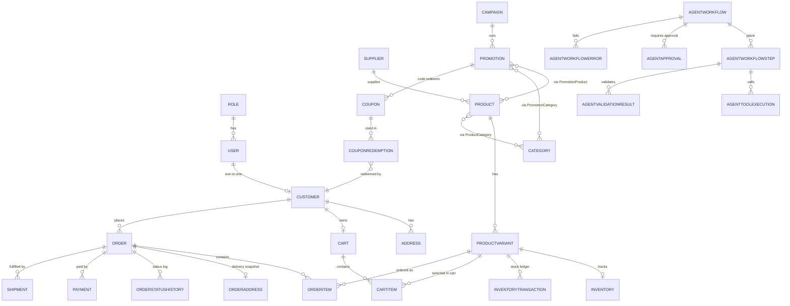

# Database Design — SEF Project (Shared PostgreSQL / EF Core Model)

This document describes the shared relational model for the whole application. All four business components (Product & Inventory, Shopping & Customer, Orders & Fulfilment, Marketing & BI), plus the shared identity and the Agentic AI subsystem, live in **one** PostgreSQL database accessed through the `SEF_Project.Api` application.

## Key conventions

- **Primary keys**: the shared identity cluster (`User`, `Role`, `Customer`, `Address`) keeps its existing **`int` identity** convention. Every **new** business entity uses a **`Guid`** primary key.
- **Audit fields**: every mutable entity inherits `GuidEntity` (`Id`, `CreatedAt`, `UpdatedAt`) and timestamps are set automatically in `AppDbContext.SaveChangesAsync` (UTC). The existing `BaseEntity` (`int Id`, `CreatedAt`, `UpdatedAt`) now shares the same `IAuditableEntity` contract.
- **Enums**: stored as strings (`HasConversion<string>()`) with a maximum length; the most stable status enums also get database CHECK constraints.
- **Money**: `decimal(18, 2)` (`numeric(18,2)` in PostgreSQL).
- **Timestamps**: `timestamp with time zone` (UTC).

## Entity list

### Shared identity (unchanged)
| Entity | Key | Owner |
|---|---|---|
| `User` | int | Shared |
| `Role` | int | Shared |
| `Customer` | int | Shared |
| `Address` | int | Shared |

### Product & Inventory
| Entity | Key | Notes |
|---|---|---|
| `Category` | Guid | flat list, unique name |
| `Product` | Guid | catalog metadata (no price); optional `SupplierId` |
| `ProductVariant` | Guid | **purchasable unit**; unique `Sku`, `Price` |
| `ProductCategory` | composite (ProductId, CategoryId) | many-to-many join |
| `Inventory` | Guid | one per variant; on-hand/reserved/reorder |
| `InventoryTransaction` | Guid | append-only stock ledger |
| `Supplier` | Guid | primary supplier per product |

### Shopping & Customer
| Entity | Key | Notes |
|---|---|---|
| `Cart` | Guid | one per customer (unique `CustomerId`) |
| `CartItem` | Guid | references `ProductVariant`; unique (CartId, ProductVariantId) |

### Orders & Fulfilment
| Entity | Key | Notes |
|---|---|---|
| `Order` | Guid | unique `OrderNumber`; status + monetary totals |
| `OrderItem` | Guid | references **`ProductVariantId`**; `UnitPrice` is a historical snapshot |
| `OrderAddress` | Guid | delivery-address snapshot (one per order) |
| `OrderStatusHistory` | Guid | append-only status audit |
| `Payment` | Guid | supports partial/refund payments |
| `Shipment` | Guid | delivery/fulfilment |

### Marketing & BI
| Entity | Key | Notes |
|---|---|---|
| `Campaign` | Guid | groups promotions |
| `Promotion` | Guid | the offer (type + discount value) |
| `PromotionProduct` | composite (PromotionId, ProductId) | product targeting |
| `PromotionCategory` | composite (PromotionId, CategoryId) | category targeting |
| `Coupon` | Guid | unique `Code`; optional `PromotionId` |
| `CouponRedemption` | Guid | usage tracking |

### Agentic AI
| Entity | Key | Notes |
|---|---|---|
| `AgentWorkflow` | Guid | objective, status, plan summary, final outcome |
| `AgentWorkflowStep` | Guid | ordered steps; records the responsible `AgentName` |
| `AgentToolExecution` | Guid | tool name + `jsonb` args/result |
| `AgentValidationResult` | Guid | validation outcome per step |
| `AgentApproval` | Guid | human approval state |
| `AgentWorkflowError` | Guid | failure audit |

## Relationship overview

## Component ownership

- **Product & Inventory**: `Category`, `Product`, `ProductVariant`, `ProductCategory`, `Inventory`, `InventoryTransaction`, `Supplier`.
- **Shopping & Customer**: `Cart`, `CartItem` (plus shared `Customer`/`Address`).
- **Orders & Fulfilment**: `Order`, `OrderItem`, `OrderAddress`, `OrderStatusHistory`, `Payment`, `Shipment`.
- **Marketing & BI**: `Campaign`, `Promotion`, `PromotionProduct`, `PromotionCategory`, `Coupon`, `CouponRedemption`.
- **Shared**: `User`, `Role`, `Customer`, `Address`, and the Agentic AI tables.

## Important business rules

- **`OrderItem` references `ProductVariantId`, never `ProductId`.** A product can have many variants; the exact variant purchased is what an order (and a cart) records.
- **`OrderItem.UnitPrice` is a historical snapshot.** It is copied from `ProductVariant.Price` at order time and must never be re-derived from the live variant price, so orders stay correct after future price changes. `LineTotal` is stored for the same reason.
- **No duplicated product/customer data.** Orders store only the variant FK plus the price snapshot; name/SKU are looked up from the catalog, not copied.
- **Stock is authoritative in `Inventory`.** `AvailableQuantity = QuantityOnHand - ReservedQuantity` is derived, not stored. Every change is recorded in `InventoryTransaction` (append-only ledger).
  - Ledger semantics: `QuantityChange` is the signed quantity moving (negative = leaving stock, positive = returned/added); `QuantityOnHandAfter` snapshots on-hand. The Orders workflow writes `Reservation` (−qty, on-hand unchanged) at checkout, `ReservationRelease` (+qty) on cancellation, and `Sale` (−qty, on-hand reduced) when an order reaches `Completed` (via the status endpoint or shipment delivery).
- **Delivery address is snapshotted** into `OrderAddress` so it survives later edits/deletes of the customer's `Address`.
- **No user/customer/order seed data** is provided because users require password hashes; the product, inventory, supplier, marketing, and workflow schema is seeded instead.

## Constraints

- **Unique**: `ProductVariant.Sku`, `Category.Name`, `Inventory.ProductVariantId`, `Cart.CustomerId`, `CartItem(CartId, ProductVariantId)`, `Order.OrderNumber`, `Coupon.Code`, `AgentWorkflowStep(WorkflowId, StepOrder)`.
- **CHECK** (positive/non-negative): `ProductVariant.Price > 0`; `OrderItem.Quantity > 0`, `OrderItem.UnitPrice > 0`, `OrderItem.LineTotal >= 0`; `CartItem.Quantity > 0`; `Payment.Amount > 0`; non-negative inventory counts and order totals.
- **Delete behavior** is deliberate: owned children cascade (`Product` → `ProductVariant` → `Inventory`/`ProductCategory`; `Order` → items/payments/shipments/history/address); cross-component and reference relationships are `Restrict` (`OrderItem` → `ProductVariant`, `Order` → `Customer`, `InventoryTransaction` → `ProductVariant`, `Product` → `Supplier`) so history and catalog integrity are preserved.

## Index strategy

Explicit indexes are added where a query pattern justifies them (FK columns already get an index automatically):

| Index | Why |
|---|---|
| `ProductVariant.Sku` (unique) | SKU lookup |
| `Category.Name` (unique) | category lookup |
| `Product.Name` | catalog search/filter |
| `Inventory.ProductVariantId` (unique) | one inventory row per variant |
| `InventoryTransaction.ProductVariantId`, `CreatedAt` | stock movement / ledger queries |
| `Cart.CustomerId` (unique) | load the current cart |
| `CartItem(CartId, ProductVariantId)` (unique) | prevent duplicate cart lines |
| `Order.OrderNumber` (unique), `CustomerId`, `Status`, `CreatedAt` | order lookup, filtering, sorting |
| `OrderItem.ProductVariantId` | "who ordered this variant" reporting |
| `OrderStatusHistory(OrderId, ChangedAt)` | time-ordered status timeline |
| `Coupon.Code` (unique), `CouponRedemption.CouponId`/`CustomerId` | coupon validation and usage limits |
| `Promotion(IsActive, StartDate, EndDate)` | active-promotion queries |
| `AgentWorkflow.Status`, `CreatedAt`; `AgentWorkflowStep(WorkflowId, StepOrder)`; `AgentApproval(WorkflowId, Status)` | workflow listing and step ordering |

## Agentic AI persistence

The model supports a multi-step, auditable workflow without storing hidden chain-of-thought:

- **`AgentWorkflow`** is the durable root: `Objective`, `Status`, `PlanSummary`, and `FinalOutcome`.
- **`AgentWorkflowStep`** is the plan: ordered steps (`StepOrder`) that record `AgentName` (Planning, Analysis, Action, Validation, …) so the responsible agent is identifiable per step.
- **`AgentToolExecution`** stores auditable tool calls/results (`ToolName`, `ToolArgumentsJson`, `ToolResultJson` — both `jsonb`).
- **`AgentValidationResult`** stores validation outcomes (`IsValid`, `ValidatorName`, `Severity`).
- **`AgentApproval`** stores human approval (`Status`, `ReviewedByUserId`, `ReviewedAt`).
- **`AgentWorkflowError`** stores failures (`ErrorType`, `Message`, `OccurredAt`).

**Hard rules**: no hidden reasoning/chain-of-thought is stored; `ToolArgumentsJson`/`ToolResultJson` must be secret-redacted (no passwords, tokens, or API keys). Agents do not get direct database access — they go through service/tool boundaries.

## Transaction-sensitive operations

These must run atomically (single `SaveChanges` / explicit transaction):

1. **Order creation** — insert `Order` + `OrderItem`s + snapshot `OrderAddress` + reserve inventory (`InventoryTransaction` + `Inventory.ReservedQuantity`) together.
2. **Inventory stock updates** — update `Inventory` and append an `InventoryTransaction` in one operation.
3. **Fulfilment** — status change + `Shipment` update + stock deduction from reserved quantity.
4. **Cancellation/refund** — release reservations, create a refund `Payment`, and record `OrderStatusHistory`.
5. **Coupon redemption** — create `CouponRedemption` and atomically enforce `UsageLimit`/`PerCustomerLimit`.
6. **High-impact Agentic AI actions** — any tool execution that writes business data must be wrapped in a transaction and leave an audit trail.

## Assumptions

- Flat category list (no self-referencing hierarchy) for now.
- One primary supplier per product (`Product.SupplierId`); no many-to-many supplier-variant table yet.
- Wishlist, product reviews/ratings, and customer preferences are **out of scope** until the team requests them.
- Prices and stock quantities are interpreted as: quantity `> 0`, price `> 0`, stock/totals `>= 0`.

## Unresolved design questions (for the team)

1. Should product/variant price be strictly positive (`> 0`) or non-negative (`>= 0`) to allow free items?
2. Do we need a category hierarchy (parent categories) for menu navigation?
3. Do we need a many-to-many supplier↔variant relationship (currently a single `SupplierId` on `Product`)?
4. Do order totals need a finer tax/fee breakdown (per-item tax, service charge) beyond the current `TaxAmount`/`ShippingFee`/`DiscountTotal`?

