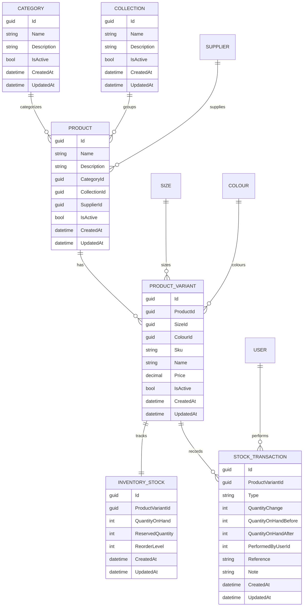

# Member 1 Product & Inventory Management Documentation

This document describes the Member 1 backend component implemented in the
ASP.NET Core API. It is based on the actual project structure, DTOs, EF Core
model, services, controllers, tests, migrations and agent workflow currently in
the repository.

## Component boundary

Member 1 owns the Product & Inventory Management business component:

- Products
- Categories
- Collections
- Product variants
- Sizes
- Colours
- Inventory stock
- Stock updates
- Stock transaction/history
- Low-stock detection
- Inventory Analysis Agent and approval workflow

The component uses the existing project stack:

- ASP.NET Core Web API
- C#
- Entity Framework Core
- PostgreSQL
- REST APIs
- JWT authentication
- Role-based authorization
- xUnit backend tests

## Product domain

The product domain is normalized around catalog master data and variants.

Main entities:

- `Category`: Groups products, for example Tops or Footwear.
- `Collection`: Groups products into seasonal/business collections, for example
  Summer Essentials or Signature Selection.
- `Product`: The sellable product concept, for example Classic Cotton T-Shirt.
- `Size`: Reusable size option, for example XS, S, M, L, XL or One Size.
- `Colour`: Reusable colour/appearance option, for example Black, White or Navy.
- `ProductVariant`: A specific sellable combination of product, size and colour.

Important product rules:

- Product names are required.
- Product create/update requires valid `CategoryId` and `CollectionId`.
- Product delete is implemented as a soft delete by setting `IsActive = false`.
- Category, collection, size and colour deletes are also soft deletes.
- Category, collection, size and colour names are unique.
- Product variant SKU is unique.
- Product + size + colour is unique.
- Product variant price must be non-negative.
- The API does not expose EF entities directly; controllers return DTOs.

## Inventory domain

Inventory is tracked at product variant level.

Main entities:

- `InventoryStock`: Current quantity state for one `ProductVariant`.
- `StockTransaction`: Immutable stock movement/history record.

Important inventory rules:

- One product variant has one inventory stock record.
- One product variant can have many stock transactions.
- Quantity on hand must not be negative.
- Reserved quantity must not be negative.
- Reorder level must not be negative.
- Quantity on hand cannot be reduced below reserved quantity.
- Low stock is detected when `QuantityOnHand <= ReorderLevel`.
- Manual stock updates support:
  - `StockIn`
  - `StockOut`
  - `Adjustment`
- Internal transaction types such as sale/receipt are not accepted through the
  manual stock adjustment endpoint.

## Entity relationships

Conceptual relationship summary:

- `Category` 1 -> many `Product`
- `Collection` 1 -> many `Product`
- `Supplier` 1 -> many `Product`
- `Product` 1 -> many `ProductVariant`
- `Size` 1 -> many `ProductVariant`
- `Colour` 1 -> many `ProductVariant`
- `ProductVariant` 1 -> 1 `InventoryStock`
- `ProductVariant` 1 -> many `StockTransaction`
- `User` 1 -> many `StockTransaction` through `PerformedByUserId`

ER diagram source:



## Database constraints and indexes

Configured in `Data/Configurations/CatalogConfigurations.cs`.

Important uniqueness and indexes:

- Unique category name.
- Unique collection name.
- Unique size name.
- Unique colour name.
- Product index on `Name`.
- Product index on `CategoryId`.
- Product index on `CollectionId`.
- ProductVariant index on `ProductId`.
- Unique ProductVariant index on `Sku`.
- Unique ProductVariant index on `ProductId + SizeId + ColourId`.
- Unique InventoryStock index on `ProductVariantId`.
- StockTransaction index on `ProductVariantId`.
- StockTransaction index on `CreatedAt`.
- StockTransaction index on `PerformedByUserId`.

Important check constraints:

- Product variant price must be `>= 0`.
- Inventory quantity on hand must be `>= 0`.
- Inventory reserved quantity must be `>= 0`.
- Inventory reorder level must be `>= 0`.
- Inventory quantity on hand must be `>= reserved quantity`.
- Stock transaction quantity change must not be zero.
- Stock transaction quantity before/after must be `>= 0`.
- Colour hex code, when present, must be seven characters and start with `#`.

Delete behaviors:

- Product -> ProductVariant: cascade.
- ProductVariant -> InventoryStock: cascade.
- ProductVariant -> StockTransaction: restrict.
- Product -> Category/Collection/Supplier: restrict from product side.
- ProductVariant -> Size/Colour: restrict.

## API endpoints

The frontend-facing endpoint contract is documented in:

- `backend/MEMBER1_FRONTEND_CONTRACT.md`

Summary:

- `GET /api/products`
- `GET /api/products/{id}`
- `GET /api/products/{id}/variants`
- `POST /api/products`
- `PUT /api/products/{id}`
- `DELETE /api/products/{id}`
- `GET /api/categories`
- `GET /api/categories/{id}`
- `POST /api/categories`
- `PUT /api/categories/{id}`
- `DELETE /api/categories/{id}`
- `GET /api/collections`
- `GET /api/collections/{id}`
- `POST /api/collections`
- `PUT /api/collections/{id}`
- `DELETE /api/collections/{id}`
- `GET /api/sizes`
- `GET /api/sizes/{id}`
- `POST /api/sizes`
- `PUT /api/sizes/{id}`
- `DELETE /api/sizes/{id}`
- `GET /api/colours`
- `GET /api/colours/{id}`
- `POST /api/colours`
- `PUT /api/colours/{id}`
- `DELETE /api/colours/{id}`
- `GET /api/variants/{id}`
- `PUT /api/variants/{id}`
- `DELETE /api/variants/{id}`
- `GET /api/inventory`
- `GET /api/inventory/low-stock`
- `GET /api/inventory/{variantId}`
- `GET /api/inventory/{variantId}/history`
- `POST /api/inventory/{variantId}/adjust`
- `POST /api/agents/inventory-analysis`
- `POST /api/inventory/agent/workflows`
- `GET /api/inventory/agent/workflows/{id}`
- `POST /api/inventory/agent/workflows/{id}/approve`
- `POST /api/inventory/agent/workflows/{id}/reject`
- `POST /api/inventory/agent/workflows/{id}/revise`

## Search, filtering, sorting and pagination

`GET /api/products` supports:

- `search`
- `categoryId`
- `collectionId`
- `isActive`
- `minPrice`
- `maxPrice`
- `sortBy`
- `sortDirection`
- `page`
- `pageSize`

The response uses `PagedResponse<T>`:

```json
{
  "items": [],
  "page": 1,
  "pageSize": 20,
  "totalItems": 0,
  "totalPages": 0
}
```

Filtering and sorting are applied through EF Core queries before pagination, so
the API does not load the whole product table into memory before filtering.

## Stock transaction behavior

Manual stock adjustment is implemented in `InventoryService.AdjustStockAsync`.

For each stock update:

1. Validate quantity and reason.
2. Convert transaction type into a signed quantity change.
3. Open an EF Core database transaction with serializable isolation.
4. Load the variant inventory.
5. Validate the resulting quantity.
6. Update `InventoryStock`.
7. Insert `StockTransaction`.
8. Save changes.
9. Commit.

If anything fails, the database transaction is rolled back. This prevents:

- Inventory changed without history.
- History created without inventory change.
- Negative stock.

## Authorization

The project uses JWT bearer authentication and role-based authorization.

Roles used by this component:

- Authenticated users can read catalog and inventory data.
- `Staff` and `Administrator` can create/update/delete catalog data.
- `Staff` and `Administrator` can adjust stock.
- `Staff` and `Administrator` can run/approve/reject/revise inventory agent
  workflows.
- Customer users are not allowed to modify catalog or inventory data.

Authentication and authorization errors are returned as `application/problem+json`.

## Validation and error responses

Validation is implemented through:

- Data annotation attributes on DTOs.
- Service-layer business validation.
- EF Core relationships, unique indexes and check constraints.
- Global exception handling.

Common response patterns:

- `400 Bad Request`: DTO validation errors or invalid references/input.
- `401 Unauthorized`: missing/invalid authentication.
- `403 Forbidden`: authenticated user does not have the required role.
- `404 Not Found`: requested entity does not exist.
- `409 Conflict`: duplicate records or business-rule conflicts.
- `500 Internal Server Error`: unexpected failure with safe generic detail.

## Agentic AI responsibility

Member 1 provides the Inventory Analysis Agent.

The agent responsibility is to analyze product/variant inventory information and
produce structured inventory recommendations. It must not directly modify stock.

The agent participates in the workflow by:

1. Receiving a structured inventory analysis request.
2. Creating/persisting workflow state.
3. Creating a visible structured plan.
4. Calling only allow-listed inventory tools.
5. Producing structured recommendations.
6. Validating model output through deterministic code.
7. Moving workflow state to pending approval.
8. Waiting for human approval/rejection/revision.
9. Executing approved operations through `InventoryService`, not through direct
   database writes.

Hidden model reasoning is not persisted.

## Agent tools

The inventory agent may use only allow-listed tools:

- `GetProductInventory`
- `GetLowStockProducts`
- `GetStockHistory`
- `GetProductDetails`

Tool arguments are validated by the backend tool registry. The agent does not
receive unrestricted database access.

## Agent input/output contracts

Input DTO:

- `InventoryAnalysisRequestDto`

Important fields:

- `WorkflowId`
- `Objective`
- `ProductIds`
- `VariantIds`
- `InventoryContext`

Output DTOs:

- `InventoryAnalysisResponseDto`
- `InventoryAgentOutputDto`
- `InventoryRecommendationDto`
- `InventoryAgentWorkflowResponseDto`

Recommendation shape:

```json
{
  "variantId": "00000000-0000-0000-0000-000000000000",
  "sku": "TSH-CLS-XS",
  "productName": "Classic Cotton T-Shirt",
  "currentStock": 3,
  "reorderLevel": 5,
  "recommendedAction": "RESTOCK",
  "recommendedQuantity": 10,
  "reason": "Current stock is below reorder level"
}
```

The output validator rejects malformed output, missing variant IDs, invalid
quantities and unsupported actions.

## Human approval workflow

Workflow endpoints:

- `POST /api/inventory/agent/workflows`
- `GET /api/inventory/agent/workflows/{id}`
- `POST /api/inventory/agent/workflows/{id}/approve`
- `POST /api/inventory/agent/workflows/{id}/reject`
- `POST /api/inventory/agent/workflows/{id}/revise`

Persisted workflow state includes:

- Workflow ID
- Objective
- Plan
- Completed steps
- Tool results/summaries
- Validation result
- Approval status
- Final outcome
- Errors
- Timestamps

Approval is deterministic:

- Reviewer must exist and be active.
- Reviewer must have an authorized role.
- Recommendation schema must be valid.
- Variant must exist.
- Recommended quantity must be valid.
- Stock operation must satisfy inventory business rules.

Only after approval can the system perform a stock operation, and it performs
that operation through the normal inventory service.

## Database migrations

Relevant Member 1 migrations currently present:

- `20260923063023_Member1ProductInventoryDomain`
- `20260923063416_MakeColourHexConstraintPortable`
- `20260923091802_AddInventoryTransactionAuditFields`
- `20260923145720_AllowZeroProductVariantPrice`
- `20260923152644_AddAgentWorkflowStepResultJson`
- `20260925005159_FashionCatalogSeed`

Apply migrations locally with:

```bash
dotnet ef database update --project backend/SEF_Project.Api
```

The CI workflow does not apply migrations to a live PostgreSQL database. It
restores dependencies, builds the solution and runs the backend tests.

## Seed data

Seed data is configured in EF Core model configuration.

Seeded catalog/inventory data includes:

- Categories:
  - Tops
  - Bottoms
  - Outerwear
  - Footwear
- Collections:
  - Summer Essentials
  - Signature Selection
  - New Arrivals
- Sizes:
  - XS
  - S
  - M
  - L
  - XL
  - One Size
- Colours:
  - Black
  - White
  - Navy
- Products:
  - Classic Cotton T-Shirt
  - Fleece Pullover Hoodie
  - Slim Fit Denim Jeans
  - Quilted Field Jacket
  - Leather Ankle Boots
- Variants:
  - `TSH-CLS-XS`
  - `TSH-CLS-M`
  - `HOD-FLC-M`
  - `HOD-FLC-L`
  - `JEA-SLM-M`
  - `JKT-QFD-L`
  - `BTS-ANK-OS`
- Inventory stock records for each seeded variant.

## Tests

Backend tests use xUnit in `backend/SEF_Project.Api.Tests`.

Member 1 test areas include:

- Product CRUD, validation, search/filter/sort/pagination.
- Category CRUD and validation.
- Collection CRUD and validation.
- Size CRUD.
- Colour CRUD and validation.
- Variant create/update/delete and duplicate/reference validation.
- Inventory current stock, StockIn, StockOut, Adjustment, negative stock
  prevention, history, low stock and rollback.
- Security metadata for authentication and role authorization.
- Database relationships, constraints, precision and indexes.
- Agent tool permissions, structured output validation, deterministic
  validation, workflow state, approval enforcement, rejection and safe failure.

Commands:

```bash
dotnet restore SEF-Project.sln
dotnet build SEF-Project.sln
dotnet test SEF-Project.sln
```

## CI readiness

Existing workflow:

- `.github/workflows/backend-ci.yml`

It runs on push and pull request and performs:

1. Checkout.
2. Setup .NET 8.
3. `dotnet restore SEF-Project.sln`
4. `dotnet build SEF-Project.sln --no-restore --configuration Release`
5. `dotnet test SEF-Project.sln --no-build --configuration Release`

No duplicate CI workflow was added because the existing workflow already covers
the required backend restore/build/test path.
