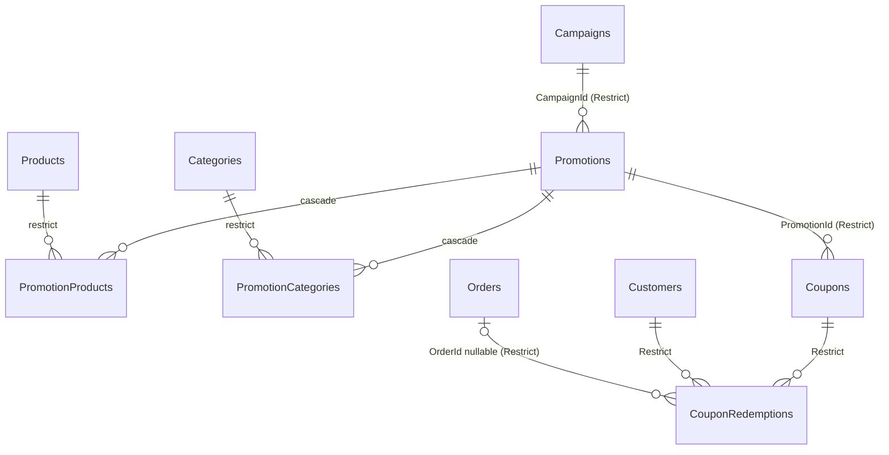

# Member 4: Marketing & Business Intelligence, Technical Documentation

| | |
|---|---|
| Component | Marketing & Business Intelligence (campaigns, promotions, analytics, Inventory & Promotion Agent) |
| Documented against | branch `feature-Marekting-and-buisness-intelligence`, commit `84accb7` (Phase 13) |
| Existing detail docs | [`backend/INVENTORY_PROMOTION_AGENT.md`](../backend/INVENTORY_PROMOTION_AGENT.md), [`backend/MARKETING_E2E_WORKFLOW.md`](../backend/MARKETING_E2E_WORKFLOW.md) |
| Companion files | [Contribution evidence](MEMBER4_CONTRIBUTION_EVIDENCE.md), [AI usage log guide](MEMBER4_AI_USAGE_LOG_GUIDE.md), [Viva study list](MEMBER4_VIVA_STUDY_LIST.md) |

> **Merge note (verified in Git).** `origin/main` has moved on since this branch. Two members' refactors
> renamed things this component uses: `PagedResponse.TotalCount` → `TotalItems` (so the JSON field
> `totalCount` is `totalItems` on `main`) and `ProductVariant.Inventory` → `InventoryStock`. This document
> describes the branch as it is. The integration merge (`aa69629`) also added the migration
> `20260925175045_FashionMarketingSeed`, so the **seed data on `main` differs** from section 5 (the catalog moved
> from pizza to fashion). After merging `main` into the branch, re-run all suites and re-check the JSON field
> names in section 6 and the seed counts in section 5.

---

## 1. Business component overview

**Purpose.** Let staff plan and run promotional campaigns, let customers see correct discounted prices, and
give management data about sales, stock, promotion results and demand, including an AI-assisted agent that
*proposes* promotions for a human to approve.

**Owned data** (per `AGENTS.md` in the workspace root): `Campaign`, `Promotion`, `PromotionProduct`,
`PromotionCategory`, `Coupon`, `CouponRedemption`. It also **reads** data owned by other components (orders,
order items, products, variants, inventory) for analytics, and **writes** to the shared Agentic AI tables.

**Actors**

| Actor | Can do |
|---|---|
| Anonymous / Customer | Read live promotions and promoted prices; a signed-in user may call `calculate-discount` |
| Staff | Everything in this component: manage campaigns and promotions, read analytics, start agent workflows, approve **low-impact** proposals |
| Administrator | Everything Staff can, plus approve **high-impact** proposals |

**Architecture**

```
React (staff UI)  ─┐                          ┌─► PostgreSQL (EF Core / Npgsql)
                   ├─► ASP.NET Core 8 API ────┤
Flutter (customer)─┘   Controller → Service   └─► Agent (in-process, allow-listed read-only tools)
                        → AppDbContext            └─ writes only via PromotionService after human approval
```

Boundaries are enforced by tests, not only by design: `ClientBoundaryTests` scans the React and Flutter
sources and fails if either touches a database driver, raw SQL, `AppDbContext` or the agent classes, or if any
file other than the single API client performs HTTP.

**Implementation status (honest scope)**

| Area | Status |
|---|---|
| Campaign and promotion management API + React UI | Implemented |
| Customer promotion browsing and pricing (API + Flutter) | Implemented |
| Analytics API + React dashboard/analytics/reports | Implemented |
| Inventory & Promotion Agent, approval flow, React review UI | Implemented |
| Coupons and redemptions | **Tables, constraints and seed data only.** No coupon endpoints or redemption logic yet |
| Applying promotions at checkout | **Not implemented.** Checkout does not read promotions or coupons (`OrderService` only echoes `DiscountTotal`) |
| `BuyXGetY`, `FreeShipping` promotion types | Can be stored; the calculator refuses to price them (409) |
| LLM-backed agent | **Not implemented.** The proposal model is a deterministic local policy behind a replaceable interface |

---

## 2. Functional requirements

| ID | Requirement | Where | Verified by |
|---|---|---|---|
| FR-1 | Staff create, read, update, delete campaigns and set their status | `CampaignsController`, React `campaigns/*` | `CampaignsApiTests`, `CampaignList/Detail/Form` tests |
| FR-2 | Staff create, read, update, delete promotions (percentage or fixed amount, dates, active flag, product and category targets) | `PromotionsController`, React `promotions/*` | `PromotionsApiTests`, `PromotionForm/List/Detail` tests |
| FR-3 | Customers only ever see *live* promotions | `PromotionService.VisiblePromotions` | `PromotionsApiTests`, `PromotionOffersApiTests` |
| FR-4 | Prices and discounts are calculated on the server from database prices, never from client input | `PromotionDiscountCalculator`, `PromotionPricingService` | `PromotionDiscountCalculatorTests`, `PromotionPricingServiceTests` |
| FR-5 | A product page shows its best live promotion and a promotion indicator | `PromotionOfferService`, Flutter `ProductDetailScreen` | `PromotionOffersApiTests`, `promotion_screens_test.dart` |
| FR-6 | Management sees sales, product performance, inventory, promotion performance and demand, with filtering, sorting, paging | `AnalyticsController`, React `analytics/*` | `AnalyticsServiceTests`, `AnalyticsApiTests`, analytics page tests |
| FR-7 | The agent proposes promotions for declining or slow-moving products | `InventoryPromotionAgentService` | `InventoryPromotionAgentTests` |
| FR-8 | A human approves, rejects or requests revision; only then are promotions created | Agent controller, React `agent/*` | `InventoryPromotionAgentTests`, `...ApprovalAuthorizationTests`, `MarketingWorkflowEndToEndTests` |
| FR-9 | Access is restricted by role | `[Authorize]` attributes | `MarketingSecurityTests` (authorization matrix) |
| FR-10 | Every agent action is auditable | Shared `AgentWorkflow*` tables | `InventoryPromotionAgentTests` |

**Non-functional:** server-side validation everywhere; multi-entity writes are atomic; page size ≤ 100 and
page ≤ 10,000; no secrets in source; analytics stay responsive at 200,000 orders (measured in Phase 13,
section 8).

---

## 3. Promotion domain

**Entity `Promotion`** (`Models/Marketing`): `Id`, optional `CampaignId`, `Name` (≤200), `Description` (≤2000),
`Type`, `DiscountValue` (decimal 18,2), `StartDate`, `EndDate`, `IsActive`, targets
(`PromotionProducts`, `PromotionCategories`), `Coupons`, audit timestamps.

**Types** (`PromotionType`): `PercentageDiscount`, `FixedAmountDiscount`, `BuyXGetY`, `FreeShipping`. Only the
first two discount an item price.

**Rules**

| Rule | Enforced in |
|---|---|
| Name required, ≤ 200 chars; description ≤ 2000 | DTO attributes, DB max length |
| Percentage discount in (0, 100]; fixed amount > 0; other types ≥ 0 | `PromotionRequest.Validate`, `PromotionDiscountCalculator`, DB `CK_Promotions_DiscountValue` |
| `EndDate ≥ StartDate` | DTO, calculator, DB `CK_Promotions_DateRange` |
| A price discount must target at least one product or category | `PromotionRequest.Validate` (an untargeted promotion applies to nothing) |
| At most 500 product IDs and 500 category IDs per request; no empty GUIDs | `[MaxLength]`, `Validate` |
| Referenced campaign, products and categories must exist | `PromotionService.ApplyRequestAsync` (400) |
| Dates must lie inside the campaign's dates; no promotions in Completed or Cancelled campaigns | `ApplyRequestAsync` (409) |
| A promotion with coupons cannot be deleted (deactivate it instead) | `DeletePromotionAsync` (409) |

**Live definition** (used for customers, offers and analytics):
`IsActive && StartDate ≤ now ≤ EndDate && (no campaign || campaign.Status == Active)`. Staff see all
promotions; everyone else sees only live ones.

**Pricing algorithm** (`PromotionDiscountCalculator`, pure and unit-tested):
1. Validate configuration, active flag, date window (both ends inclusive, UTC) and price > 0.
2. Percentage: `round(price × value / 100, 2)`. Fixed: `round(value, 2)`. Rounding is half away from zero.
3. `discount = min(discount, price)`, so a price never goes negative. `final = price − discount`.
4. A promotion applies to a variant if it targets the variant's product **or** one of the product's categories.
5. **Best promotion**: for a product, the largest discount amount wins. Ties go to the first in order
   (soonest `EndDate`, then `Id`), so the result is deterministic.

---

## 4. Campaign domain

**Entity `Campaign`:** `Id`, `Name` (≤200), `Description` (≤2000), `StartDate`, `EndDate`, `Status`, `Promotions`.

**Status** (`CampaignStatus`): `Draft`, `Scheduled`, `Active`, `Paused`, `Completed`, `Cancelled`.

| Rule | Enforced in |
|---|---|
| `EndDate ≥ StartDate` | DTO, DB `CK_Campaigns_DateRange` |
| Status must be a known value | DB `CK_Campaigns_Status` (generated from the enum) |
| `Completed` and `Cancelled` are terminal: status cannot change | `CampaignService.UpdateCampaignAsync` (409) |
| New dates must still cover every promotion in the campaign | `UpdateCampaignAsync` (409) |
| A campaign with promotions cannot be deleted (cancel it instead) | `DeleteCampaignAsync` (409) |
| Promotions inside a non-`Active` campaign are not live | `VisiblePromotions`, `LivePromotions`, analytics `IsLive` |

There is no transition table between `Draft`, `Scheduled`, `Active` and `Paused`: any of these may move to
any other. Only the two terminal states are locked. Responses include `promotionCount`.

---

## 5. Database relationships



| Table | Key | Notes |
|---|---|---|
| `Campaigns` | `Id` (Guid) | `Status` stored as string |
| `Promotions` | `Id` | optional `CampaignId`; `Type` as string; `DiscountValue` decimal(18,2) |
| `PromotionProducts` | (`PromotionId`, `ProductId`) | join table |
| `PromotionCategories` | (`PromotionId`, `CategoryId`) | join table |
| `Coupons` | `Id` | unique `Code`; `UsageLimit`, `PerCustomerLimit`, validity window |
| `CouponRedemptions` | `Id` | links coupon, customer and optional order |

**Delete behaviour:** owned join rows cascade from their promotion; every cross-component and reference
foreign key is `Restrict`, so history is never silently removed.

**Indexes**

| Index | Serves |
|---|---|
| `Campaigns(Status)`, `Campaigns(StartDate, EndDate)` | campaign filters |
| `Promotions(IsActive, StartDate, EndDate)` | "live promotions" queries |
| `Coupons(Code)` **unique** | code lookup, uniqueness |
| `CouponRedemptions(CouponId, OrderId)` **unique** | one redemption per coupon per order; usage-limit lookups |
| `CouponRedemptions(CustomerId)`, `(RedeemedAt)` | per-customer limits, date-range analytics |

**CHECK constraints:** `CK_Campaigns_DateRange`, `CK_Campaigns_Status`, `CK_Promotions_DiscountValue`,
`CK_Promotions_DateRange`, `CK_Promotions_Type`, `CK_Coupons_UsageLimit`, `CK_Coupons_PerCustomerLimit`,
`CK_Coupons_DateRange`. The discount check casts to `REAL` so it behaves the same on SQLite (used in tests,
which stores decimals as text) and PostgreSQL.

**Migration:** the tables came from `AddSharedDomainModel`. This component's migration is
`20260923072703_AddMarketingDomainConstraints`: it replaces `Campaigns.IsActive` with `Status`
(`true → Active`, `false → Paused`, reversible), and adds the CHECK constraints and indexes above.

**Seed data** (fixed GUIDs in `SeedData.cs`): 2 campaigns, 4 promotions, 2 coupons, 3 product links,
1 category link. Verified against a real PostgreSQL database in Phase 12, including constraint rejection
(a 150% discount is refused by the database itself).

**Tables this component only reads:** `Orders`, `OrderItems`, `Products`, `ProductVariants`, `Inventory`.
**Tables it writes for the agent:** `AgentWorkflows`, `AgentWorkflowSteps`, `AgentToolExecutions`,
`AgentValidationResults`, `AgentApprovals`, `AgentWorkflowErrors` (no schema change was needed).

---

## 6. API endpoints

JSON is camelCase. Enums are numeric in request bodies. All list endpoints share the paging rules below.
Errors follow RFC 7807 (`title`, `status`, `detail`; validation errors add `errors`).

**Paging (all lists):** `page` 1–10,000 (default 1), `pageSize` 1–100 (default 20). Out of range → 400.

### Promotions: `/api/promotions`

| Method & path | Access | Purpose |
|---|---|---|
| `GET /` | Public | List. Query: `page, pageSize, sortBy (name/startDate/endDate/discountValue/createdAt), sortDirection, search, type, isActive, campaignId, activeOn`. Non-staff see live only |
| `GET /{id}` | Public | One promotion (404 if missing or not visible) |
| `GET /{id}/products` | Public | Eligible products of a **live** promotion with server-calculated prices |
| `GET /products/{productId}` | Public | A product's live promotions and its variants priced with the best one |
| `GET /targets` | Staff | Products and categories a promotion can target |
| `POST /` | Staff | Create (201) |
| `PUT /{id}` | Staff | Replace |
| `DELETE /{id}` | Staff | Delete (409 if it has coupons) |
| `POST /{id}/calculate-discount` | Signed in | Body `{ productVariantId }`; price read from the database |

### Campaigns: `/api/campaigns` (Staff)

`GET /`, `GET /{id}`, `POST /`, `PUT /{id}`, `DELETE /{id}`. List query: `page, pageSize, sortBy, sortDirection,
search, status, activeOn`.

### Analytics: `/api/analytics` (Staff)

| Path | Query (besides `from`/`to`) |
|---|---|
| `GET /sales/summary` | none |
| `GET /sales/over-time` | `granularity` = Day / Month |
| `GET /products/performance` | paging, `sortBy` (unitsSold/revenue/orderCount/name), `sortDirection`, `includeInactive` |
| `GET /inventory/stock` | paging, `sortBy` (availableQuantity/quantityOnHand/sku/productName), `stockStatus`, `search`, `includeInactive` |
| `GET /inventory/summary` | `includeInactive` |
| `GET /promotions/performance` | paging, `sortBy` (redemptions/revenue/discountAmount/name), `liveOnly` |
| `GET /demand` | paging, `sortBy` (unitsSold/trend/availableQuantity/sku), `includeInactive` |

`from`/`to` are a half-open UTC range `[from, to)`; default is the last 30 days ending now; the maximum span is 3 years.

### Agent: `/api/agents/inventory-promotion` (Staff)

| Method & path | Purpose |
|---|---|
| `POST /workflows` | Start (201). Body in section 14 |
| `GET /workflows?limit=` | Recent workflows (1–100) |
| `GET /workflows/{id}` | Full workflow: plan, proposal, pricing, steps, tool executions, validation, approvals, errors |
| `POST /workflows/{id}/approve` | Approve (`{ comment? }`); high impact needs Administrator |
| `POST /workflows/{id}/reject` | Reject |
| `POST /workflows/{id}/revise` | Request revision (`{ comment, maxDiscountPercent?, maxProposals?, excludeProductIds? }`) |

**Controller conventions:** `[ApiController]`, class-level `[Authorize]`, `CancellationToken` on every action,
the caller's id read from `ClaimTypes.NameIdentifier`, DTOs (never entities) returned. A service returning
`null` becomes 404.

---

## 7. Business rules (summary)

1. Prices come from the database; clients send identifiers only.
2. A discount never exceeds the item price; money is rounded half away from zero to 2 decimals.
3. Live = active flag + date window + active campaign (section 3).
4. Campaign and promotion dates must nest; terminal campaigns are locked; parents with children cannot be deleted.
5. Multi-entity writes are atomic (promotion create/update and the agent's batch create use a transaction).
6. The agent never writes directly; promotions are created only by `PromotionService` **after** approval.
7. High-impact proposals (any discount ≥ 20% or more than 3 proposals) need an Administrator.
8. Each approval can be decided exactly once, even under concurrent requests (section 16).
9. Sales analytics count only orders in `Confirmed`, `Preparing`, `Ready`, `Completed`.

---

## 8. Analytics calculations

All aggregation is done **in the database**. Money is summed as `double` (SQLite cannot `SUM` decimals) and
rounded to 2 decimals; this is exact below about 10^13. Sales = orders in the four statuses above, filtered by
`PlacedAt` in the range.

| Metric | Definition |
|---|---|
| Order count | number of sales orders in range |
| Gross sales | Σ `Order.Subtotal` |
| Discount total | Σ `Order.DiscountTotal` |
| Net revenue | Σ `Order.Total` |
| Average order value | net revenue ÷ order count (0 when none) |
| Units sold | Σ `OrderItem.Quantity` of sales orders |
| Sales over time | grouped by UTC day; months are folded from days; missing periods filled with zero; daily is capped at 366 points |
| Product performance | per product: units, distinct order count, Σ `LineTotal`; **starts from Products** so unsold products appear (needed for low performers) |
| Stock status | `available = onHand − reserved`; `OutOfStock` ≤ 0; `LowStock` ≤ reorder level; else `InStock`. A variant with no inventory row counts as 0 |
| Promotion performance | per promotion: coupon count, redemptions and unique customers in range; redeemed **distinct** sales orders, their revenue and discount; `isLive` per section 3 |

**Sorting** is stable and deterministic (ties broken by name/SKU then id). Money sorts cast to `double` so it
also works on SQLite.

**Phase 13 performance change.** Product performance and demand originally used one correlated subquery per
row, which re-scanned the order items for every product or variant. They now aggregate once with `GROUP BY`
and left-join. Measured on PostgreSQL with 200k orders, 400k order items and 305 products (5 runs each):

| Endpoint | Before | After |
|---|---|---|
| Product performance, 30 days | ~1,000–6,000 ms | ~50–200 ms |
| Product performance, 365 days | ~1,000–5,800 ms | ~450–500 ms |
| Demand, 365 days | ~2,000–6,700 ms | ~300–400 ms |
| Demand sorted by trend | 6,000–18,000 ms | ~200 ms |

Results were checked against the original SQL and are identical, including tie order. An index on
`Orders.PlacedAt` was measured and gave no benefit, so none was added.

---

## 9. Demand insight methodology

Endpoint: `GET /api/analytics/demand`. One row per **product variant** (active variants of active products
unless `includeInactive`).

1. Let the range be `[from, to)` with length `span`. The **current window** is `[from, to)`; the **previous
   window** is `[from − span, from)`, the same length immediately before.
2. `unitsSold` and `previousUnitsSold` = Σ quantity of sales-order items in each window.
3. `unitsPerDay = unitsSold ÷ span-in-days` (2 decimals).
4. `trendPercent = (unitsSold − previous) × 100 ÷ previous` (1 decimal). It is `null` when `previous = 0`.
5. **Trend label:** both zero → `NoSales`; previous zero → `New`; ≥ +10% → `Rising`; ≤ −10% → `Falling`; else `Stable`.
6. `availableQuantity = onHand − reserved` (0 without an inventory row).
7. `daysOfCover = max(available, 0) ÷ unitsPerDay` (1 decimal); `null` when nothing sold.

Sorting by `trend` places variants **without a baseline last**, in either direction, so a brand-new item
cannot outrank a real decline. The agent uses this endpoint (via the `GetSalesVelocity` tool) to find
candidates: "declining" = sales down ≥ 10% versus the previous window; "slow moving" = no sales with stock, or
more than 60 days of cover.

Limitations: it compares two adjacent windows only (no seasonality); it measures units, not margin.

---

## 10. React architecture

Stack: React 19, Vite, React Router 7, Vitest + Testing Library, plain JavaScript/JSX; no UI or state library.

```
src/
  services/      api.js (the ONLY fetch call), promotionService, campaignService, analyticsService, agentService
  contexts/      AuthContext (token held in memory only)
  hooks/         useAsync (load + reload, ignores stale responses), useListQuery (filters/sort/page live in the URL)
  routes/        ProtectedRoute (requires login + role)
  components/    shared UI (AppLayout, Pagination, FormField, StatusViews, …) and in-house charts (BarList, LineChart)
  features/marketing/
    MarketingLayout, MarketingOverviewPage, marketingConstants (MANAGER_ROLES = Staff, Administrator)
    promotions/  List, Detail, Form(+Page)
    campaigns/   List, Detail, Form(+Page)
    analytics/   Dashboard, Analytics, Reports, DateRangeFilter, KPI + 5 sections
    agent/       WorkflowList, WorkflowStart, WorkflowDetail (approve / reject / revise)
```

* **Data flow:** page → `useAsync(loader)` → feature service → `apiRequest(endpoint, { token })` → API.
  `apiRequest` adds the bearer token, parses JSON, and throws an `Error` carrying `status` and `data`; the UI
  shows `detail` or `title` from the problem response.
* **State:** local component state plus the two hooks. List filters are in the URL, so they survive reload
  and can be shared; changing a filter resets to page 1.
* **Routing:** every `/marketing/*` route sits under `ProtectedRoute roles={MANAGER_ROLES}`. This only guards
  navigation; **the API enforces authorization**.
* **UX states:** loading, empty, error-with-retry on each page; forms validate then surface API errors.
* **Tests:** 131 tests in 18 files for the frontend suite on this branch.

---

## 11. Flutter architecture

Customer-facing, read-only promotions. One dependency beyond Flutter itself: `http`.

```
lib/
  main.dart                       SefApp -> PromotionsScreen
  core/api/       api_client.dart (only file that imports http), api_exception.dart
  core/auth/      token_store.dart (TokenStore interface; in-memory default)
  core/config/    app_config.dart (API_BASE_URL via --dart-define; default http://10.0.2.2:5193/api)
  core/format/    formatters.dart (LKR money, dates)
  core/state/     async_controller.dart (ChangeNotifier + sealed LoadState: Loading / Loaded / Failed)
  core/widgets/   state_views.dart (loading, empty, error views)
  features/promotions/
    data/         promotion_repository.dart (interface + API implementation)
    models/       promotion_models.dart (JSON -> immutable models)
    screens/      promotions_screen, promotion_detail_screen, product_detail_screen
    widgets/      promotion_widgets.dart (PromotionIndicator, PriceTag, VariantPriceRow)
```

* **API integration:** screens → repository → `ApiClient.getJson`. The client attaches the bearer token only
  over HTTPS or to a local development host, clears the stored token on 401, applies a 15 s timeout and turns
  every failure into an `ApiException` with a user-safe message.
* **State management:** built-in `ChangeNotifier` + `ListenableBuilder`; no state-management package.
* **Prices are never computed on the device.** It shows the server's `finalPrice`, with the original struck
  through and a semantics label such as "Now LKR 960.00, was LKR 1,200.00".
* **Endpoints used** (all public): list live promotions, promotion, promotion products, product promotions.
* **Tests:** 38 tests in 6 files, run for real in Phase 13 (see section 19). Static analysis was not run.
* **Not built:** login, cart or checkout screens (other components).

---

## 12. Inventory & Promotion Agent

Code: `SEF_Project.Api/AI/InventoryPromotion/`. The agent **only proposes**. It has no `AppDbContext`, cannot run
SQL, and cannot call arbitrary APIs. Promotions are created only by `PromotionService` after a human approves.

```
Objective → gather data (tools) → draft proposal (model) → price on server → deterministic validation
          → human approval → re-validate with fresh data → create via PromotionService
```

**Components**

| Component | Role |
|---|---|
| `InventoryPromotionAgentService` | Orchestrator; persists every step to the shared workflow tables |
| `PromotionAgentToolRegistry` | The only way to run a tool: permission check, validation, timeout, retry, redaction, audit |
| `IPromotionAgentTool` (×6) | Read-only capabilities backed by existing services |
| `IPromotionProposalModel` | Replaceable AI boundary. Registered: `LocalPromotionProposalModel` (deterministic policy) |
| `PromotionProposalValidator` | Strict parsing + business-rule checks (fail closed) |

**State machine** (`AgentWorkflowStatus`):

```
Planning → InProgress → AwaitingApproval ─approve→ InProgress → Completed
                │              ├─reject→ Cancelled
                │              └─revise→ Planning → InProgress → AwaitingApproval …(max 3)
                ├─ no product qualifies → Completed (no approval needed)
                └─ any failure → Failed (nothing changed)
```

**Local policy.** *DecliningSales:* sales down ≥ 10% → discount 10%, 15% (drop ≥ 25%) or 20% (drop ≥ 50%),
capped by the request's maximum. *SlowMoving:* no sales with stock, or > 60 days of cover. Products with a live
promotion, too little stock, or excluded by the reviewer are skipped. Promotions start the next day and run
14 days.

**Not stored:** hidden reasoning or chain-of-thought. Malformed model output is discarded (only its length is
noted). Stored JSON is redacted for secret-like keys (`password`, `token`, `secret`, `apikey`, `authorization`,
`connectionstring`).

**Configuration** (`InventoryPromotionAgent` section, all have defaults): `ToolTimeout` 5 s, `ModelTimeout` 20 s,
`MaxToolRetries` 2, `MaxRevisions` 3, `HighImpactDiscountPercent` 20, `HighImpactProposalCount` 3,
`MaxPromotionDays` 60, `MaxModelOutputCharacters` 50,000, `MaxToolOutputCharacters` 256,000.

---

## 13. Agent tools

Allow-list (`PromotionAgentConstants.AllowedTools`), all read-only:

| Tool | Arguments (strictly validated) | Backed by |
|---|---|---|
| `GetSalesVelocity` | `analysisDays` 7–90, `limit` 1–100 | `IAnalyticsService.GetDemandInsightsAsync` (sorted by trend) |
| `GetInventory` | `productIds` 1–50 GUIDs | `IAnalyticsService.GetInventoryStockAsync` |
| `GetActivePromotions` | none | `IPromotionService.GetPromotionsAsync` (live only) |
| `GetProductDetails` | `productIds` 1–50 | `IPromotionOfferService.GetProductPromotionsAsync` |
| `GetProductPricing` | `productIds` 1–50 | `IPromotionOfferService.GetProductPromotionsAsync` |
| `CalculatePromotion` | `productId`, `promotionType` (allowed values only), `discountValue` 0.01–1,000,000, `startDate`, `endDate` | `PromotionDiscountCalculator` (nothing saved) |

**Registry guarantees:** a name outside the allow-list is refused and logged even if a class exists; unknown or
ill-typed arguments and out-of-range values are rejected **without retry**; every result must contain its
required property and stay under the size limit; each call has a timeout; transient failures get at most 2
retries; every attempt (success or failure) is stored as an `AgentToolExecution`. Two tests enforce the
boundary: the registered tools must equal the allow-list exactly, and no tool or model class may take a
`DbContext`.

---

## 14. Agent input/output contracts

**Input:** `POST /api/agents/inventory-promotion/workflows`

```json
{ "objective": "Find products with declining sales and recommend suitable promotions.",
  "focus": 0, "analysisDays": 30, "maxProposals": 5, "maxDiscountPercent": 30 }
```

| Field | Rule |
|---|---|
| `objective` | required, 10–500 chars |
| `focus` | **numeric on the wire**: `0` = `DecliningSales`, `1` = `SlowMoving` (the API has no string-enum converter; the React form sends 0/1) |
| `analysisDays` | 7–90 |
| `maxProposals` | 1–10 |
| `maxDiscountPercent` | 1–50 |

**Revise input:** `comment` (3–1000, required), optional `maxDiscountPercent`, `maxProposals`,
`excludeProductIds` (≤ 100). **Review comment** (approve/reject): ≤ 1000 chars.

**Model output (the only thing the model may produce):**

```json
{ "schemaVersion": "1.0", "summary": "…",
  "proposals": [ { "productId": "GUID", "productName": "…", "promotionType": "PercentageDiscount",
    "discountValue": 15, "startDate": "2026-10-16T00:00:00Z", "endDate": "2026-10-30T00:00:00Z",
    "rationale": "10–500 characters citing the evidence",
    "evidence": { "unitsSold": 3, "previousUnitsSold": 4, "availableQuantity": 35 } } ] }
```

Parsing is strict: not JSON, unknown properties, wrong `schemaVersion`, a missing required field, a disallowed
promotion type, a rationale outside 10–500 characters, more than 10 proposals, or output longer than the limit
all reject the **whole** output (`MalformedOutput`).

---

## 15. Agent validation

Facts are rebuilt from tool data, never taken from the model. Any failed check fails the workflow
(`ValidationFailed`); nothing is repaired.

| Rule | Checks |
|---|---|
| `ProposalLimit` | count ≤ `maxProposals`; no product proposed twice |
| `ProductExists` | product exists and is active |
| `ReviewerConstraints` | product not excluded by the reviewer |
| `SufficientInventory` | available stock above the reorder level and > 0 |
| `DiscountLimits` | effective % in (0, `maxDiscountPercent`]; fixed amounts measured against the cheapest variant |
| `PromotionDates` | starts today or later; lasts 1–60 days |
| `NoConflict` | no live promotion already on the product |
| `EvidenceMatchesData` | the model's figures equal the tool data exactly (stops invented numbers) |
| `ServerPricing` | the server priced every variant, and no final price is zero or unchanged |

At approval time everything is checked again against **current** data; only `EvidenceMatchesData` is skipped
(sales figures legitimately drift). A proposal that no longer passes fails as `StaleProposal`.

---

## 16. Human approval flow

| Impact | Trigger | Who may approve |
|---|---|---|
| Low | every discount < 20% **and** ≤ 3 proposals | Staff or Administrator |
| High | any discount ≥ 20% **or** > 3 proposals | Administrator only (a Staff attempt is refused with 409) |

* **Approve:** claim the decision → re-validate with fresh tool data → create all promotions atomically via
  `CreatePromotionsAsync` → record the created IDs → `Completed`.
* **Reject:** claim → `Cancelled`; nothing changes.
* **Revise:** claim → record `RevisionRequested` → new proposal cycle under the tighter limits; refused after 3.
* **Decisions are single-use.** Approve, reject and revise all claim the pending approval with a conditional
  `UPDATE … WHERE Status = 'Pending'` inside a transaction. If two reviewers (or a double click) race, exactly
  one wins and the other receives 409 before anything is created. This was a real defect found in Phase 13: the
  earlier in-memory "is it pending?" check let two requests both pass and create the promotions twice. Three
  regression tests reproduce it.
* **Audit:** who decided (`ReviewedByUserId`), when, and the comment are stored on `AgentApproval`.

---

## 17. Error handling

`GlobalExceptionHandler` maps exceptions to RFC 7807 responses; unexpected errors return a generic message and
log the detail on the server only.

| Exception | Status | Typical cause |
|---|---|---|
| `ArgumentException` | 400 | a request references a campaign, product or category that does not exist |
| `UnauthorizedAccessException` | 401 | |
| `InvalidOperationException` | 409 | business-rule violation, terminal campaign, already-decided approval, insufficient role for high impact |
| anything else | 500 | generic `"An unexpected error occurred."` |
| model validation | 400 | DataAnnotations / `IValidatableObject` (`errors` map) |
| missing/invalid token | 401 | authentication middleware |
| valid token, wrong role | 403 | authorization middleware |

**Agent failures** are never surfaced as raw exceptions. They become a persisted `AgentWorkflowError` with one
of: `ToolFailure`, `ToolTimeout`, `ToolNotPermitted`, `MalformedOutput`, `ModelTimeout`, `ValidationFailed`,
`StaleProposal`, `UnexpectedError`. The workflow ends `Failed`, pending business changes are detached so nothing
partial is saved, and `finalOutcome` says "no promotions were created".

**Clients:** React shows `detail`/`title` and offers retry; Flutter maps failures to `ApiException` with safe
messages for 404, 5xx, timeouts and network errors.

---

## 18. Security controls

| Control | Implementation | Verified by |
|---|---|---|
| Authentication | JWT bearer: issuer, audience, lifetime and signature validated | `MarketingSecurityTests` (expired, wrong key/issuer/audience, unsigned, tampered payload → 401) |
| Role-based authorization | `[Authorize(Roles = "Staff,Administrator")]` on campaigns, analytics, agent and promotion management | Authorization matrix over all 27 endpoints × anonymous / Customer / Staff / Administrator |
| Customer permissions | read live promotions; `calculate-discount` when signed in; no management or analytics (403) | matrix |
| High-impact approval | Administrator only | `...ApprovalAuthorizationTests`, `ApproveAsync_ShouldRequireAdministrator...` |
| Server-side validation | DataAnnotations, `IValidatableObject`, service rules, DB CHECK constraints | API tests, `MarketingDatabaseModelTests` |
| Bounded input | page ≤ 10,000, pageSize ≤ 100, ID lists ≤ 500 / 100, text lengths | `MarketingSecurityTests`, mutation-checked |
| No client-supplied prices | pricing endpoints accept identifiers only | `PromotionPricingServiceTests` |
| Safe errors | generic 500 message; no stack traces in responses | `GlobalExceptionHandlerTests`, `MarketingSecurityTests` |
| Secrets | `appsettings.Development.json` is git-ignored; the committed example holds placeholders; git history was scanned (the file was committed once with logging settings only) | manual scan, Phase 13 |
| Safe logging | no passwords, tokens or emails logged; agent JSON redacted | code review, `JsonRedactor` test |
| Agent isolation | no DB access for the model or tools; allow-list equals registered tools; only the orchestrator holds `AppDbContext` | reflection tests in `MarketingSecurityTests` |
| Agent limits | per-tool timeout, ≤ 2 retries, ≤ 3 revisions, output size caps, strict schema | `InventoryPromotionAgentTests` |
| Client boundaries | React/Flutter reach only the API; Flutter refuses to send a token over plain HTTP to a non-local host | `ClientBoundaryTests`, `api_client_test.dart` |

**Known gaps (not fixed, recommended):** CORS allows any origin (acceptable for local development only; tokens
are in headers, not cookies); no rate limiting on login or the public promotion list; any
`InvalidOperationException`, including a framework-thrown one, becomes a 409 with its raw message; client
disconnects are logged as errors; `AuthService` hard-codes a 60-minute `ExpiresAt` instead of using
`JwtSettings.ExpiryMinutes`; the Orders list has the same unbounded-`page` defect that was fixed here.

---

## 19. Testing

**Latest full run (Release, 2026-09-26):** backend **439 / 439**, React **131 / 131**, Flutter **38 / 38**.
React lint has 1 error that pre-dates this work (`AuthContext.jsx`, `react-refresh/only-export-components`);
`flutter analyze` could not be run on the machine used.

| Area | Main files (test methods) |
|---|---|
| Discount rules | `PromotionDiscountCalculatorTests` (14), `PromotionPricingServiceTests` (13) |
| Promotion API | `PromotionsApiTests` (29), `PromotionOffersApiTests` (7), `PromotionServiceTransactionTests` (4) |
| Campaign API | `CampaignsApiTests` (16) |
| Analytics | `AnalyticsServiceTests` (23), `AnalyticsApiTests` (5) |
| Database | `MarketingDatabaseModelTests` (11), `DatabaseModelTests` (9) |
| Agent | `InventoryPromotionAgentTests` (25, including 3 concurrency tests), `InventoryPromotionAgentApiTests` (6), `...ApprovalAuthorizationTests` (1) |
| Security | `MarketingSecurityTests` (23 methods = 112 executed cases), `GlobalExceptionHandlerTests` (4), `JwtServiceTests` (1) |
| Architecture | `ClientBoundaryTests` (4) |
| End to end | `MarketingWorkflowEndToEndTests` (1) |
| React | promotion, campaign, analytics, agent, utility and route tests (18 files) |
| Flutter | `api_client` (10), `formatters` (6), `promotion_models` (5), `promotion_repository` (4), `promotion_screens` (12), `widget_test` (1) |

(Backend counts are `[Fact]`/`[Theory]` methods; theories expand to more executed cases, hence 439 total.)

**Approach.** Service tests build services directly on SQLite in-memory with the seed data. API tests run the
real pipeline through `WebApplicationFactory<Program>` (routing, JWT, roles, validation, exception handler) with
a fixed clock and real persisted fixture users per role. Provider-specific behaviour was additionally verified
on a real PostgreSQL database (migration, constraints, indexes, the conditional-update claim, and the
performance measurements).

**Run**

```bash
dotnet test SEF-Project.sln                       # backend (from the repo root)
cd frontend/SEF-Project && npm test && npm run lint && npm run build
cd mobile/sef_project_mobile/sef_project && flutter test
```

**CI** (`.github/workflows/backend-ci.yml`): restores, builds and tests the .NET solution on every push and on
pull requests to `main`/`develop`. GitHub Actions shows all 13 runs on this branch passing. CI does **not** run
the React or Flutter suites, and the pull-request filter names `develop` while the integration branch is
`development` (pushes to it are still covered by the `push` trigger).

**Bugs the tests found:** a test-factory bug (synthetic user IDs that violated a foreign key), the approval race
(section 16), the unbounded page number (500 on PostgreSQL) and, for Flutter, one wrong test expectation (the
price label is merged into the card's semantics node).

---

## 20. End-to-end workflow

> A marketing user wants the system to find products with declining demand and propose promotions.

| # | Step | Where |
|---|---|---|
| 1 | Staff/Administrator signs in | `POST /api/Auth/login` → JWT |
| 2 | React starts a workflow with the objective | `POST /api/agents/inventory-promotion/workflows` (role-checked) |
| 3 | Workflow row and fixed plan are created | `AgentWorkflow` |
| 4 | Agent gathers sales velocity, live promotions, inventory, details, pricing | 5 read-only tool calls, each audited |
| 5 | Model drafts a structured proposal; it is parsed strictly | `LocalPromotionProposalModel` + `Parse` |
| 6 | Server prices each proposal | `CalculatePromotion` |
| 7 | Deterministic validation (9 rules) | `PromotionProposalValidator` |
| 8 | Workflow pauses `AwaitingApproval`; impact is assessed | approval step + `AgentApproval` |
| 9 | React shows the proposal, evidence, pricing and validation | `GET .../workflows/{id}` |
| 10 | Reviewer approves, rejects or requests revision | `POST .../approve|reject|revise` |
| 11 | On approve: decision claimed, data re-validated, promotions created atomically | `ApproveAsync` → `PromotionService.CreatePromotionsAsync` |
| 12 | Promotion is stored in PostgreSQL; workflow `Completed` with created IDs | `Promotions`, `AgentWorkflows` |
| 13 | Once the start date arrives, an unauthenticated Flutter/React customer sees the discounted price | `GET /api/promotions/products/{id}` |

`MarketingWorkflowEndToEndTests` executes this whole path over the real HTTP pipeline on every test run.
[`backend/MARKETING_E2E_WORKFLOW.md`](../backend/MARKETING_E2E_WORKFLOW.md) has captured JSON for each step and a
manual procedure against a running API and PostgreSQL.

*Naming note:* the scenario calls the paused state "PendingManagerApproval"; the implemented enum value is
`AwaitingApproval` (same meaning; renaming would break the shipped API contract).

*Phase 14 corrected the two older docs:* `INVENTORY_PROMOTION_AGENT.md` showed `focus` as a string (it is numeric over HTTP) and
lacked the concurrency-safe approval claim of section 16; `MARKETING_E2E_WORKFLOW.md` said Flutter had not been run (it has: 38 tests passing).
